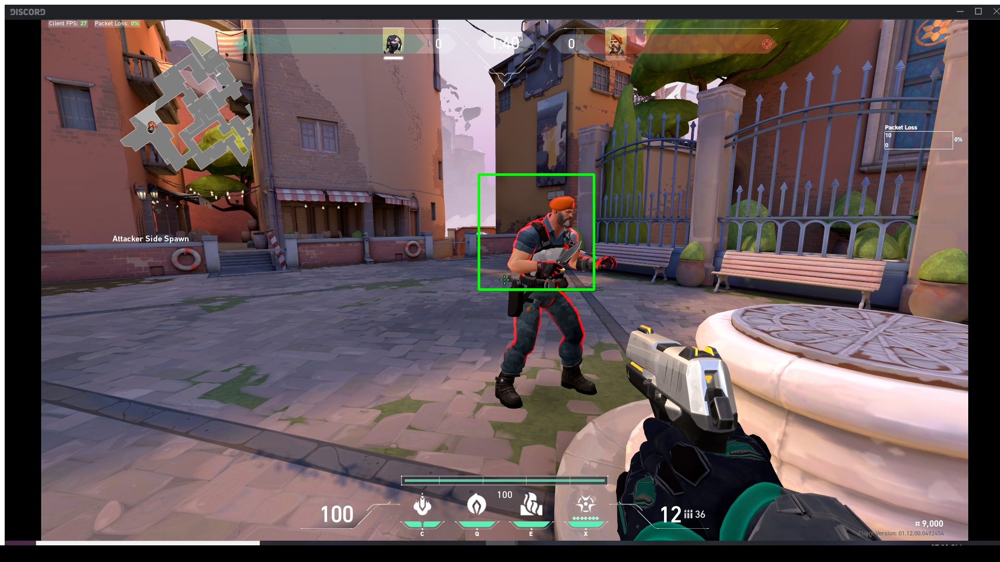

# object_detection_inside_a_game

This program will help you find the objects which you want to find after creating a cascade.xml with the dataset of pictures which is provided.

##Method##
Here we atleast 100 pictures of dataset (more the merrier) with the object which you want to detect present in it.
Create another folder containing twice the number of dataset in which the required object is not present (twice here is preffered but it should be not less than the first dataset).
Download the latest version of 3.4 opencv library from here https://sourceforge.net/projects/opencvlibrary/files/.
Download the .exe, after downloading it has prebuilt zip extractor, specify the path and wait until it get extracted.
Then goto the following path /opencv/build/x64/vc15/bin/ .
Then open a cmd, cd to that directory and type the following command "opencv_annotation.exe --annotations=pos.txt" --images=path_of_the_dataset_with_the_required_object/" 
After running it it will open a opencv window with all the images in it. 
Draw a box in that window around the object and it will be marked red, then press 'c' on your keyboard to confirm the selection and press 'd' to delete the selection and press 'n' to proceed to next image.
Repeat the process for all the images.
Then open the pos.txt file which was generated and replace the '\' to '/'.
Repeat the same for the second dataset but dont draw boxes in it(just skip everything and create another text file as neg.txt which is in my case).
Then again in the cmd execute the following line "opencv_createsamples.exe -info pos.txt -w 24 -h 24 -num 1000 -vec pos.vec" (here -w and -h value make sure it is between 20 and 24 and the -num value must be larger than the number of squares or rectanges which has been drawn)
Create a folder there called cascade (which is in my case).
Atlast in order to train the model execute the following code "opencv_traincascade.exe -data cascade/ -vec pos.vec -bg neg.txt -w 24 -h 24 -precalcValBufSize 6000 -precalcIdxBufSize 6000 -numPos 123 -numNeg 246 -numStages 12 -maxFalseAlarmRate 0.3 -minHitRate 0.999" (here numPos and numNeg are the number of pictures in each dataset)
After this process we can find the cascade.xml in the cascade folder.
Copy cascade.xml to the location where the python files are present.
Also Change the Window name inside the python code.

##Final Result##

